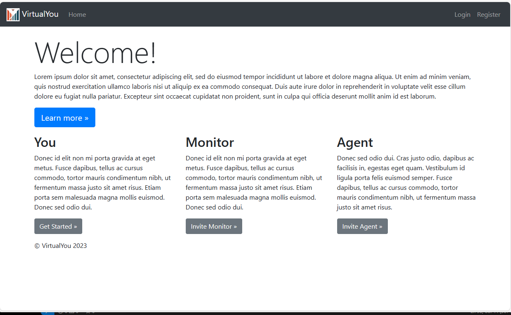

# vite-mvp


DLW TESTING
## Current Features
- JWT Authentication and Authorization example using React Hooks, React Router, Axios and Bootstrap (without Redux):
- JWT Authentication Flow for User Signup & User LoginComponent
- Project Structure for React Authentication (without Redux) with React Router & Axios
- Creating React Components with Form Validation using Formik and Yup
- React Pages for accessing protected Resources (Authorization)
- Dynamic Navigation Bar in React App

## Project Setup
Follow these steps to run this application locally.
1. `git clone https://github.com/dlwhitehurst/virtualyou`
2. `cd virtualyou/vy-app`
3. Export the ENV variable below to provide a basepath for the authentication and user services.

### Environment
Now copy these exports into an `.env` file. This file has been placed in `.gitignore`.
```bash
REACT_APP_API_BASEPATH_AUTH="http://localhost:3004/api/v1/auth/"
REACT_APP_API_BASEPATH_USER="http://localhost:3004/api/v1/"
REACT_APP_MIDDLEWARE_TARGET="http://localhost:3004"

NOTE: These are only for local testing. Production specifics will not be described here.
````
### Run
Install dependencies:
```bash
npm install
```
Now start the Node server for dynamic development and hot-reloads.
```
npm start
```

- The application will open and render in your default browser.
- The page will reload if you make edits.

## NOTES:
- Removed `<h3>{content}</h3>` from home page to replace with "public" content for VirtualYou
  
